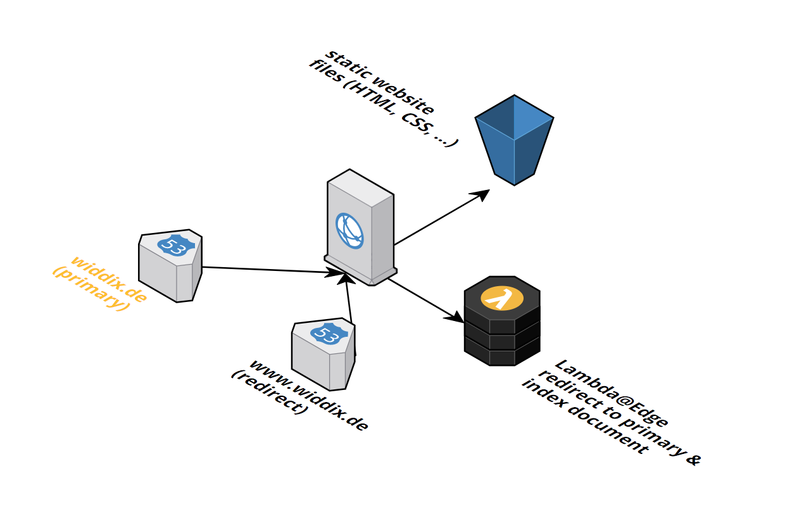

<iframe src="https://ghbtns.com/github-btn.html?user=widdix&repo=aws-cf-templates&type=star&count=true&size=large" frameborder="0" scrolling="0" width="160px" height="30px"></iframe>

# Static website with CDN
This template describes the infrastructure for hosting a static website over HTTPS behind a CDN.

## Index Document / Default Root Object

S3 and CloudFront behave differently when it comes to index document support in subdirectories. You might expect that if you have a subdirectory (e.g. `folder`) with a `index.html` file inside, that you get the file if you make q HTTP request to `/folder/`. Unfortunately, that's not the default behavior of CloudFront but there is a workaround using Lambda@Edge.

### S3 Website Hosting behavior with Index Document (not provided by the template!)

| Resource             | Response                   | Comment                                                                                     |
| -------------------- | -------------------------- | --------------------------------------------------------------------------------------------|
| `/`                  | 200 Content of index.html  |                                                                                             |
| `/index.html`        | 200 Content of index.html  | Not SEO friendly because of duplicate content on `/`, should redirect to `/`                |
| `/folder`            | 302 Redirect to `/folder/` |                                                                                             |
| `/folder/`           | 200 Content of index.html  |                                                                                             |
| `/folder/index.html` | 200 Content of index.html  | Not SEO friendly because of duplicate content on `/folder/`, should redirect to `/folder/`  |

### CloudFront with Default Root Object (provided by the template static-website.yaml template!)

| Resource             | Response                   | Comment                                                                                     |
| -------------------- | -------------------------- | --------------------------------------------------------------------------------------------|
| `/`                  | 200 Content of index.html  |                                                                                             |
| `/index.html`        | 200 Content of index.html  | Not SEO friendly because of duplicate content on `/`, should redirect to `/`                |
| `/folder`            | 403 Error                  | Not user friendly                                                                           |
| `/folder/`           | 403 Error                  | Not user friendly                                                                           |
| `/folder/index.html` | 200 Content of index.html  | Not user friendly                                                                           |

### Lambda@Edge solution (provided by the template static-website.yaml and lambdaedge-index-document.yaml template!)

To improve the default CloudFront behavior, we developed a Lambda@Edge solution that gives you the following search engine optimized result.

| Resource             | Response                   |
| -------------------- | -------------------------- |
| `/`                  | 200 Content of index.html  |
| `/index.html`        | 302 Redirect to `/`        |
| `/folder`            | 302 Redirect to `/folder/` |
| `/folder/`           | 200 Content of index.html  |
| `/folder/index.html` | 302 Redirect to `/folder/` |

## Installation Guide

We highly recommend to use the Lambda@Edge solution. If you don't require proper Index Document / Default Root Object support, you can skip the Lambda@Edge installation

### Lambda@Edge

1. Switch to the us-east-1 (N. Virginia) region
1. 
1. Click **Next** to proceed with the next step of the wizard.
1. Specify a name and all parameters for the stack.
1. Click **Next** to proceed with the next step of the wizard.
1. Click **Next** to skip the **Options** step of the wizard.
1. Check the **I acknowledge that this template might cause AWS CloudFormation to create IAM resources.** checkbox.
1. Click **Create** to start the creation of the stack.
1. Wait until the stack reaches the state **CREATE_COMPLETE**
1. Copy the `LambdaVersionArn` output of the stack.

### CloudFront

1. 
1. Click **Next** to proceed with the next step of the wizard.
1. Specify a name and all parameters for the stack.
    a. If you want to use the Lambda@Edge solution, set the `LambdaEdgeSubdirectoriesLambdaVersionArn` to the value of the `LambdaVersionArn` output. 
1. Click **Next** to proceed with the next step of the wizard.
1. Click **Next** to skip the **Options** step of the wizard.
1. Check the **I acknowledge that this template might cause AWS CloudFormation to create IAM resources.** checkbox.
1. Click **Create** to start the creation of the stack.
1. Wait until the stack reaches the state **CREATE_COMPLETE**

## Dependencies
* `vpc/zone-*.yaml`
* `static-website/lambdaedge-index-document.yaml`
